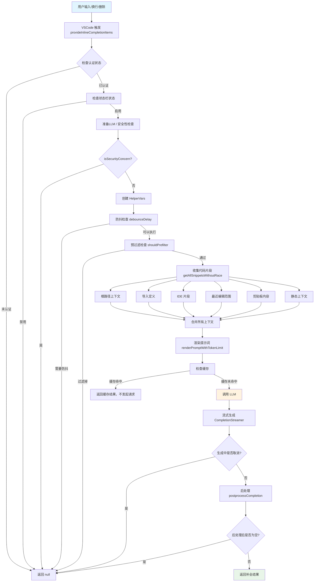
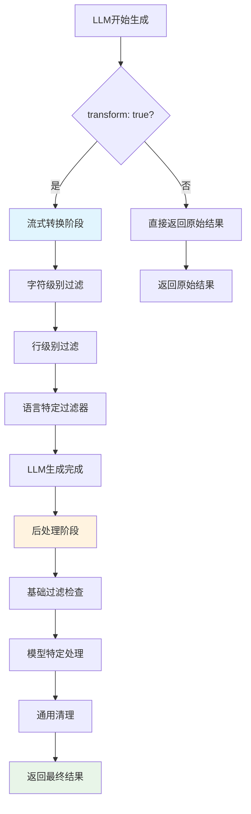

# Continue 自动补全完整技术文档：架构、流程与实现详解

DEFAULT_AUTOCOMPLETE_OPTS

## 1. 整体架构图



## 2. 关键分支与时序说明

### 2.1 前置且不发起请求的检查

#### A. 安全性检查 `isSecurityConcern`

- **检查时机**：在准备 LLM 之后，创建 HelperVars 之前
- **检查内容**：文件路径是否匹配安全敏感文件模式
- **匹配规则**：
  - 环境文件：`*.env`, `.env*`, `config.json`, `settings.json` 等
  - 证书密钥：`*.key`, `*.pem`, `*.p12`, `*.crt` 等
  - 敏感目录：`.ssh/`, `.secrets/`, `.aws/`, `.gcp/` 等
- **命中结果**：直接 `return undefined`，不发起 LLM 请求

#### B. 防抖检查 `debounceDelay`

- **检查时机**：在创建 HelperVars 之后，预过滤之前
- **检查内容**：`AutocompleteDebouncer.delayAndShouldDebounce()`
- **防抖逻辑**：

  ```typescript
  async delayAndShouldDebounce(debounceDelay: number): Promise<boolean> {
    const requestId = uuidv4();
    this.currentRequestId = requestId;

    return new Promise<boolean>((resolve) => {
      this.debounceTimeout = setTimeout(() => {
        const shouldDebounce = this.currentRequestId !== requestId;
        resolve(shouldDebounce);
      }, debounceDelay);
    });
  }
  ```

- **默认延迟**：350ms（可配置）
- **命中结果**：直接 `return undefined`，不发起 LLM 请求

#### C. 预过滤检查 `shouldPrefilter`

- **检查时机**：在防抖检查之后，上下文收集之前
- **检查内容**：`shouldPrefilter(helper, ide)`
- **过滤条件**：
  - `helper.options.disable` 为 true
  - 当前文件是 Continue 配置文件
  - 文件匹配 `disableInFiles` 模式
  - 空白 Untitled 文件（无内容）
- **命中结果**：直接 `return undefined`，不发起 LLM 请求

#### D. 缓存命中 `cacheHit`

- **检查时机**：在上下文收集和提示词渲染之后，LLM 请求之前
- **检查内容**：`AutocompleteLruCache.get(helper.prunedPrefix)`
- **缓存逻辑**：
  - 键：代码前缀
  - 值：补全结果
  - 容量：1000 个条目
  - 匹配：支持部分匹配
- **命中结果**：直接返回缓存结果，不发起 LLM 请求

### 2.2 已发起请求后的取消/失败/空结果

#### A. 生成中取消 `aborted_during_generation`

- **触发时机**：在 LLM 流式生成过程中
- **触发条件**：`token.aborted` 为 true
- **常见场景**：
  - 用户快速输入，新请求取消旧请求
  - 用户移动光标，取消当前生成
  - 用户按 Esc 键取消
- **Telemetry**：`autocomplete_cancelled`，`reason: "aborted_during_generation"`

#### B. 生成/后处理出错 `error_during_processing`

- **触发时机**：LLM 请求失败或后处理异常
- **错误类型**：
  - 网络错误：连接超时、API 限流等
  - 模型错误：token 超限、模型不可用等
  - 解析错误：响应格式异常等
- **Telemetry**：
  - `autocomplete_llm_request_failed`：记录错误详情
  - `autocomplete_cancelled`，`reason: "error_during_processing"`

#### C. 后处理后为空 `empty_completion`

- **触发时机**：LLM 生成完成，后处理结果为空
- **可能原因**：
  - 模型未生成任何内容
  - 后处理过滤掉了所有内容
  - Transform 模式下的清理过于严格
- **Telemetry**：
  - `autocomplete_llm_request_success`：记录生成成功
  - `autocomplete_cancelled`，`reason: "empty_completion"`

## 3. Telemetry 对应节点（与流程图一一对应）

将流程节点与事件埋点对上号，便于漏斗与归因。

- 触发（B 节点）→ `autocomplete_triggered`
- 开始 LLM 请求（U 节点）→ `autocomplete_llm_request_start`
- 生成成功（V 结束后）→ `autocomplete_llm_request_success`
- 生成失败（异常）→ `autocomplete_llm_request_failed`
- 取消类（D 返回的多种情况）→ `autocomplete_cancelled`，`reason` 如：
  - 生成中：`aborted_during_generation`
  - 生成/后处理错误：`error_during_processing`
  - 后处理为空：`empty_completion`

### 触发后拦截检查的时序说明

**重要**：`autocomplete_triggered` 事件在函数入口立即上报，**早于所有拦截检查**。

```typescript
// 在 CompletionProvider.provideInlineCompletionItems 中
// 1. 立即上报触发事件
void Telemetry.capture("autocomplete_triggered", triggeredEvent);

// 2. 然后才进行各种拦截检查（这些检查不会上报取消事件）
const llm = await this._prepareLlm();
if (!llm) return undefined;  // 无 telemetry 事件

if (isSecurityConcern(input.filepath)) return undefined;  // 无 telemetry 事件

if (await this.debouncer.delayAndShouldDebounce(...)) return undefined;  // 无 telemetry 事件

if (await shouldPrefilter(helper, this.ide)) return undefined;  // 无 telemetry 事件
```

**注意**：前置检查（防抖、预过滤、安全检查、无LLM等）被拦截时，**不会上报任何 `autocomplete_cancelled` 事件**，只是简单返回 `undefined`。只有已发起LLM请求后的取消才会触发 `autocomplete_cancelled` 事件。

## 4. 触发时机与前置条件

### 4.1 触发时机

#### A. 自动触发（InlineCompletionTriggerKind.Automatic）

- **VS Code 自动触发**：由 VS Code 编辑器根据用户行为自动调用补全提供程序
- **触发时机**：包括用户停止输入、新行、删除操作等（具体由 VS Code 内部逻辑控制）
- **Continue 处理**：当 `context.triggerKind === vscode.InlineCompletionTriggerKind.Automatic` 时，Continue 会响应自动触发请求

#### B. 手动触发（InlineCompletionTriggerKind.Invoke）

- **快捷键触发**：`Ctrl+Alt+Space` (Windows/Linux) 或 `Cmd+Alt+Space` (Mac)
- **命令触发**：通过命令面板调用 `continue.forceAutocomplete` 命令
- **API 触发**：通过 `editor.action.inlineSuggest.trigger` 命令触发

#### C. 代码中的触发检测

```typescript
// completionProvider.ts
```

### 4.2 触发限制总结

#### ✅ **会触发的情况**

1. **认证通过**：通过 Shihuo 认证检查
2. **状态栏启用**：`StatusBarStatus.Enabled`
3. **非取消状态**：请求未被取消
4. **非 SCM 文件**：不在 Git 源代码管理界面
5. **单光标模式**：只有一个光标
6. **有效编辑器**：有活动的文本编辑器
7. **Notebook 支持**：Jupyter Notebook 单元格
8. **未保存文件**：有内容的临时文件
9. **选中补全**：输入 ≥4 字符且文本匹配

#### ❌ **不会触发的情况**

1. **认证失败**：未通过 Shihuo 认证
2. **状态栏禁用**：`StatusBarStatus.Disabled` 或 `Paused`
3. **请求被取消**：`token.isCancellationRequested`
4. **SCM 文件**：`document.uri.scheme === "vscode-scm"`
5. **多光标编辑**：`editor.selections.length > 1`
6. **无活动编辑器**：`!vscode.window.activeTextEditor`
7. **选中补全不匹配**：输入 <4 字符或文本不匹配

## 5. 上下文收集

### 5.1 概述

并行获取多源上下文（根路径/导入/IDE/最近编辑/剪贴板/静态），统一交给渲染环节裁剪。

### 5.2 HelperVars 类

负责收集和管理自动补全所需的所有变量：

- 文件路径和内容
- 光标位置（前缀/后缀）
- 语言信息
- AST 树路径
- 工作区 URI

### 5.3 代码片段收集 getAllSnippetsWithoutRace

**核心实现**：`core/autocomplete/snippets/getAllSnippets.ts:220-267`

**注意**：实际使用 `getAllSnippetsWithoutRace` 函数，该函数不使用 `racePromise` 超时机制，所有上下文收集都是完整收集，无超时保护。

#### 5.3.1 并行收集架构

```typescript
// getAllSnippetsWithoutRace 核心实现
const [
  rootPathSnippets, // 根路径上下文
  importDefinitionSnippets, // 导入定义
  ideSnippets, // IDE 片段
  diffSnippets, // 差异片段
  clipboardSnippets, // 剪贴板内容
  recentlyOpenedFileSnippets, // 最近打开文件
  staticSnippet, // 静态上下文
] = await Promise.all([
  contextRetrievalService.getRootPathSnippets(helper),
  contextRetrievalService.getSnippetsFromImportDefinitions(helper),
  IDE_SNIPPETS_ENABLED
    ? getIdeSnippets(helper, ide, getDefinitionsFromLsp)
    : [],
  [], // getDiffSnippets 暂时禁用
  getClipboardSnippets(ide),
  getSnippetsFromRecentlyOpenedFiles(helper, ide),
  helper.options.experimental_enableStaticContextualization
    ? contextRetrievalService.getStaticContextSnippets(helper)
    : [],
]);
```

## 6. 提示词渲染

### 6.1 概述

提示词渲染是 Continue 自动补全的核心环节，负责将收集的上下文信息转换为 LLM 可以理解的提示词格式。主要涉及两个核心函数：

- **`renderPrompt`**：基础渲染，无 token 限制
- **`renderPromptWithTokenLimit`**：带 token 限制的智能渲染

### 6.2 renderPromptWithTokenLimit 核心实现

**文件位置**：`core/autocomplete/templating/index.ts:212-315`

#### 6.2.1 基本流程

```typescript
export function renderPromptWithTokenLimit({
  snippetPayload,
  workspaceDirs,
  helper,
  llm,
}: {
  snippetPayload: SnippetPayload;
  workspaceDirs: string[];
  helper: HelperVars;
  llm: ILLM | undefined;
}): {
  prompt: string;
  prefix: string;
  suffix: string;
  completionOptions: Partial<CompletionOptions> | undefined;
} {
  // 1. 准备提示词上下文
  const {
    prefix: initialPrefix,
    suffix: initialSuffix,
    reponame,
    template,
    compilePrefixSuffix,
    completionOptions,
    snippets,
  } = preparePromptContext({ snippetPayload, workspaceDirs, helper });

  // 2. 构建初始提示词
  let {
    prompt,
    prefix: compiledPrefix,
    suffix: compiledSuffix,
  } = buildPrompt(
    template,
    compilePrefixSuffix,
    prefix,
    suffix,
    helper,
    snippets,
    workspaceDirs,
    reponame,
  );

  // 3. Token 限制处理
  if (llm) {
    const prune = pruneLength(llm, prompt);
    if (prune > 0) {
      // 智能裁剪 prefix 和 suffix
      // ... 裁剪逻辑
    }
  }

  // 4. 返回最终结果
  return {
    prompt,
    prefix: compiledPrefix,
    suffix: compiledSuffix,
    completionOptions: { ...completionOptions, stop: stopTokens },
  };
}
```

#### 6.2.2 上下文准备 (preparePromptContext)

```typescript
function preparePromptContext({ snippetPayload, workspaceDirs, helper }): {
  prefix: string;
  suffix: string;
  reponame: string;
  template: AutocompleteTemplate["template"];
  compilePrefixSuffix: AutocompleteTemplate["compilePrefixSuffix"] | undefined;
  completionOptions: Partial<CompletionOptions> | undefined;
  snippets: AutocompleteSnippet[];
} {
  // 确定基础 prefix/suffix
  let prefix = helper.input.manuallyPassPrefix || helper.prunedPrefix;
  let suffix = helper.input.manuallyPassPrefix ? "" : helper.prunedSuffix;
  if (suffix === "") {
    suffix = "\n";
  }

  const reponame = getUriPathBasename(workspaceDirs[0] ?? "myproject");
  const { template, compilePrefixSuffix, completionOptions } =
    getTemplate(helper);
  const snippets = getSnippets(helper, snippetPayload);

  return {
    prefix,
    suffix,
    reponame,
    template,
    compilePrefixSuffix,
    completionOptions,
    snippets,
  };
}
```

#### 6.2.3 提示词构建 (buildPrompt)

```typescript
function buildPrompt(
  template: AutocompleteTemplate["template"],
  compilePrefixSuffix: AutocompleteTemplate["compilePrefixSuffix"] | undefined,
  prefix: string,
  suffix: string,
  helper: HelperVars,
  snippets: AutocompleteSnippet[],
  workspaceDirs: string[],
  reponame: string,
): { prompt: string; prefix: string; suffix: string } {
  if (compilePrefixSuffix) {
    // 使用自定义编译函数
    [prefix, suffix] = compilePrefixSuffix(
      prefix,
      suffix,
      helper.filepath,
      reponame,
      snippets,
      helper.workspaceUris,
    );
  } else {
    // 使用默认格式化
    const formatted = formatSnippets(helper, snippets, workspaceDirs);
    prefix = [formatted, prefix].join("\n");
  }

  // 渲染模板
  const prompt =
    typeof template === "string"
      ? renderStringTemplate(
          template,
          prefix,
          suffix,
          helper.lang,
          helper.filepath,
          reponame,
        )
      : template(
          prefix,
          suffix,
          helper.filepath,
          reponame,
          helper.lang.name,
          snippets,
          helper.workspaceUris,
        );

  return { prompt, prefix, suffix };
}
```

### 6.3 模板系统

#### 6.3.1 模板类型

Continue 支持两种模板类型：

1. **字符串模板**：使用 Handlebars 语法
2. **函数模板**：自定义渲染逻辑

#### 6.3.2 模型特定模板

```typescript
// 根据模型选择模板
export function getTemplateForModel(model: string): AutocompleteTemplate {
  const lowerCaseModel = model.toLowerCase();

  if (lowerCaseModel.includes("mercury")) {
    return mercuryMultifileFimTemplate;
  }
  if (lowerCaseModel.includes("qwen") && lowerCaseModel.includes("coder")) {
    return qwenCoderFimTemplate;
  }
  if (
    lowerCaseModel.includes("starcoder") ||
    lowerCaseModel.includes("stable")
  ) {
    return stableCodeFimTemplate;
  }
  if (lowerCaseModel.includes("gpt") || lowerCaseModel.includes("claude")) {
    return holeFillerTemplate;
  }

  return stableCodeFimTemplate; // 默认模板
}
```

#### 6.3.3 主要模板示例

**1. StableCode FIM 模板**

```typescript
const stableCodeFimTemplate: AutocompleteTemplate = {
  template: "<fim_prefix>{{{prefix}}}<fim_suffix>{{{suffix}}}<fim_middle>",
  completionOptions: { stop: ["<fim_prefix>", "<fim_suffix>", "<fim_middle>"] },
};
```

**2. Hole Filler 模板（GPT/Claude）**

```typescript
const holeFillerTemplate: AutocompleteTemplate = {
  template: (prefix: string, suffix: string) => {
    const SYSTEM_MSG = `You are a HOLE FILLER. You are provided with a file containing holes, formatted as '{{HOLE_NAME}}'. Your TASK is to complete with a string to replace this hole with, inside a <COMPLETION/> XML tag...`;
    return SYSTEM_MSG + `\n<QUERY>\n${prefix}${suffix}\n</QUERY>\n<COMPLETION>`;
  },
  completionOptions: { stop: ["</COMPLETION>"] },
};
```

### 6.4 代码片段格式化

#### 6.4.1 formatSnippets 实现

```typescript
export const formatSnippets = (
  helper: HelperVars,
  snippets: AutocompleteSnippet[],
  workspaceDirs: string[],
): string => {
  const currentFilepathComment = addCommentMarks(
    getLastNUriRelativePathParts(workspaceDirs, helper.filepath, 2),
    helper,
  );

  return (
    snippets
      .map((snippet) => {
        switch (snippet.type) {
          case AutocompleteSnippetType.Code:
            return formatCodeSnippet(snippet, workspaceDirs);
          case AutocompleteSnippetType.Diff:
            return formatDiffSnippet(snippet);
          case AutocompleteSnippetType.Clipboard:
            return formatClipboardSnippet(snippet, workspaceDirs);
          case AutocompleteSnippetType.Static:
            return formatStaticSnippet(snippet);
        }
      })
      .map((item) => {
        return commentifySnippet(helper, item).content;
      })
      .join("\n") + `\n${currentFilepathComment}`
  );
};
```

#### 6.4.2 代码片段过滤 (getSnippets)

```typescript
export const getSnippets = (
  helper: HelperVars,
  payload: SnippetPayload,
): AutocompleteSnippet[] => {
  const snippets = {
    clipboard: payload.clipboardSnippets,
    recentlyVisitedRanges: payload.recentlyVisitedRangesSnippets,
    recentlyEditedRanges: payload.recentlyEditedRangeSnippets,
    diff: payload.diffSnippets,
    recentlyOpenedFiles: payload.recentlyOpenedFileSnippets,
    base: shuffleArray(
      filterSnippetsAlreadyInCaretWindow(
        [
          ...payload.rootPathSnippets,
          ...payload.importDefinitionSnippets,
          ...payload.staticSnippet,
        ],
        helper.prunedCaretWindow,
      ),
    ),
  };

  // 按优先级处理片段
  const snippetConfigs = [
    {
      key: "clipboard",
      enabledOrPriority: helper.options.experimental_includeClipboard,
      defaultPriority: 1,
    },
    {
      key: "recentlyOpenedFiles",
      enabledOrPriority: helper.options.useRecentlyOpened,
      defaultPriority: 2,
    },
    {
      key: "recentlyVisitedRanges",
      enabledOrPriority:
        helper.options.experimental_includeRecentlyVisitedRanges,
      defaultPriority: 3,
    },
    {
      key: "recentlyEditedRanges",
      enabledOrPriority:
        helper.options.experimental_includeRecentlyEditedRanges,
      defaultPriority: 4,
    },
    {
      key: "diff",
      enabledOrPriority: helper.options.experimental_includeDiff,
      defaultPriority: 5,
    },
    { key: "base", enabledOrPriority: true, defaultPriority: 6 },
  ];

  // 智能过滤和排序
  // ... 处理逻辑

  return finalSnippets;
};
```

### 6.5 Token 限制与智能裁剪

#### 6.5.1 Token 计算

```typescript
function pruneLength(llm: ILLM, prompt: string): number {
  const contextLength = llm.contextLength;
  const reservedTokens = llm.completionOptions.maxTokens ?? DEFAULT_MAX_TOKENS;
  const safetyBuffer = getTokenCountingBufferSafety(contextLength);
  const maxAllowedPromptTokens = contextLength - reservedTokens - safetyBuffer;
  const promptTokenCount = countTokens(prompt, llm.model);
  return promptTokenCount - maxAllowedPromptTokens;
}
```

#### 6.5.2 智能裁剪策略

```typescript
if (llm) {
  const prune = pruneLength(llm, prompt);
  if (prune > 0) {
    const tokensToDrop = prune;
    const prefixTokenCount = countTokens(prefix, helper.modelName);
    const suffixTokenCount = countTokens(suffix, helper.modelName);
    const totalContextTokens = prefixTokenCount + suffixTokenCount;

    if (totalContextTokens > 0) {
      // 按比例分配裁剪
      const dropPrefix = Math.ceil(
        tokensToDrop * (prefixTokenCount / totalContextTokens),
      );
      const dropSuffix = Math.ceil(tokensToDrop - dropPrefix);
      const allowedPrefixTokens = Math.max(0, prefixTokenCount - dropPrefix);
      const allowedSuffixTokens = Math.max(0, suffixTokenCount - dropSuffix);

      // 从顶部裁剪 prefix，从底部裁剪 suffix
      prefix = pruneLinesFromTop(prefix, allowedPrefixTokens, helper.modelName);
      suffix = pruneLinesFromBottom(
        suffix,
        allowedSuffixTokens,
        helper.modelName,
      );
    }
  }
}
```

### 6.6 停止标记处理

```typescript
const stopTokens = getStopTokens(
  completionOptions,
  helper.lang,
  helper.modelName,
);

return {
  prompt,
  prefix: compiledPrefix,
  suffix: compiledSuffix,
  completionOptions: {
    ...completionOptions,
    stop: stopTokens,
  },
};
```

### 6.7 渲染流程总结

1. **上下文准备**：收集所有必要的上下文信息
2. **模板选择**：根据模型选择适当的模板
3. **片段格式化**：将代码片段格式化为可读格式
4. **提示词构建**：使用模板渲染最终提示词
5. **Token 限制**：智能裁剪超出限制的内容
6. **停止标记**：设置适当的停止标记
7. **返回结果**：返回完整的渲染结果

这个渲染系统确保了 Continue 能够为不同的 LLM 模型提供最优的提示词格式，同时智能地管理 token 使用，提供高质量的代码补全体验。

合并裁剪上下文，输出前缀/后缀与提示词，受 token 预算限制。

- 合并所有收集的代码片段
- 根据模型的 token 限制裁剪内容
- 生成最终的提示词
- 返回前缀、后缀和补全选项

## 7. 缓存机制

### 7.1 AutocompleteLruCache

前缀为键的 LRU 缓存，命中直接返回结果，不发起 LLM 请求。

- **容量**：1000 个条目
- **存储**：SQLite 数据库
- **键**：代码前缀
- **值**：补全结果
- **匹配**：支持部分匹配（如 "co" 可以匹配 "c" -> "ontinue"）
- **重要时序**：命中缓存（流程图 S→T）时，不会发起 LLM 请求

## 8. Transform 选项详解

### 8.1 Transform 模式的具体处理

当 `transform: true` 时，系统会执行**两个阶段**的处理：

#### **阶段 1：流式转换（StreamTransformPipeline）**

- LLM 生成内容
- 实时流式转换处理（`StreamTransformPipeline`）
- 超时时间：`modelTimeout × 2.5`（Transform: true）或 `modelTimeout`（Transform: false）

```typescript
// StreamTransformPipeline.transform() 执行顺序
charGenerator = stopAtStopTokens(generator, [...stopTokens, ...STOP_AT_PATTERNS]);
charGenerator = stopAtStartOf(charGenerator, suffix);
// 语言特定字符过滤器
for (const charFilter of helper.lang.charFilters ?? []) {
  charGenerator = charFilter({...});
}

lineGenerator = streamLines(charGenerator);
lineGenerator = stopAtLines(lineGenerator, fullStop);
lineGenerator = stopAtLinesExact(lineGenerator, fullStop, [lineBelowCursor]);
lineGenerator = stopAtRepeatingLines(lineGenerator, fullStop);
lineGenerator = avoidEmptyComments(lineGenerator, helper.lang.singleLineComment);
lineGenerator = avoidPathLine(lineGenerator, helper.lang.singleLineComment);
lineGenerator = skipPrefixes(lineGenerator);
lineGenerator = noDoubleNewLine(lineGenerator);
// 语言特定行过滤器
for (const lineFilter of helper.lang.lineFilters ?? []) {
  lineFilter({...});
}
lineGenerator = stopAtSimilarLine(lineGenerator, lineBelowCursor, fullStop);
lineGenerator = showWhateverWeHaveAtXMs(lineGenerator, timeoutValue);
```

#### **阶段 2：后处理（postprocessCompletion）**

- 基础过滤检查
- 模型特定处理
- 通用清理
- 无额外超时限制，处理时间通常很短

```typescript
// 1. 基础过滤
if (isBlank(completion)) return undefined; // 过滤空白补全
if (isOnlyWhitespace(completion)) return undefined; // 过滤纯空格补全
if (rewritesLineAbove(completion, prefix)) return undefined; // 过滤重复行
if (isExtremeRepetition(completion)) return undefined; // 过滤极端重复

// 2. 模型特定的处理
if (llm.model.includes("codestral")) {
  // Codestral 模型：移除多余空格，处理换行问题
  if (completion[0] === " " && completion[1] !== " ") {
    if (prefix.endsWith(" ") && suffix.startsWith("\n")) {
      completion = completion.slice(1);
    }
  }
  // 避免双重换行
  if (
    suffix.length === 0 &&
    prefix.endsWith("\n\n") &&
    completion.startsWith("\n")
  ) {
    completion = completion.slice(1);
  }
}

if (llm.model.includes("qwen3")) {
  // Qwen3 模型：移除思考标记和多余换行
  completion = completion.replace(/<think>.*?<\/think>/s, "");
  completion = completion.replace(/<\/think>/, "");
  completion = completion.replace(/^\n+|\n+$/g, "");
}

if (llm.model.includes("granite")) {
  // Granite 模型：处理重复前缀问题
  let prefixEnd = prefix.split("\n").pop();
  if (prefixEnd) {
    if (completion.startsWith(prefixEnd)) {
      completion = completion.slice(prefixEnd.length);
    } else {
      const trimmedPrefix = prefixEnd.trim();
      const lastWord = trimmedPrefix.split(/\s+/).pop();
      if (lastWord && completion.startsWith(lastWord)) {
        completion = completion.slice(lastWord.length);
      } else if (completion.startsWith(trimmedPrefix)) {
        completion = completion.slice(trimmedPrefix.length);
      }
    }
  }
}

if (llm.model.includes("mercury")) {
  // Mercury 模型：处理缩进问题
  if (
    (completion.startsWith("  ") || completion.startsWith("\t")) &&
    !prefix.endsWith("\n") &&
    (suffix.startsWith("\n") || suffix.trim().length === 0)
  ) {
    completion = "\n" + completion;
  }
}

if (llm.model.includes("gemini") || llm.model.includes("gemma")) {
  // Gemini/Gemma 模型：移除文件分隔符
  if (completion.endsWith("<|file_separator|>")) {
    completion = completion.slice(0, -18);
  }
}

// 3. 通用清理
if (prefix.endsWith(" ") && completion.startsWith(" ")) {
  completion = completion.slice(1); // 处理空格重复问题
}
completion = removeBackticks(completion); // 移除 Markdown 代码块标记
```

#### **完整的执行流程**

```typescript
// 阶段 1：流式生成 + 流式转换（有超时限制）
// 在 CompletionStreamer.ts 中的实际实现：

// 1. 创建基础生成器（带超时控制）
const generator = this.generatorReuseManager.getGenerator(
  prefix,
  (abortSignal: AbortSignal) => {
    const generator = llm.supportsFim()
      ? llm.streamFim(prefix, suffix, abortSignal, completionOptions)
      : llm.streamComplete(prompt, abortSignal, {
          ...completionOptions,
          raw: true,
        });

    // 应用 2.5 倍超时（仅当 transform: true 时）
    return helper.options.transform
      ? stopAfterMaxProcessingTime(
          generator,
          helper.options.modelTimeout * 2.5, // ← 2.5 倍超时
          fullStop,
        )
      : generator;
  },
  multiline,
);

// 2. 应用流式转换管道（仅当 transform: true 时）
const transformedGenerator = helper.options.transform
  ? this.streamTransformPipeline.transform(
      initialGenerator,
      prefix,
      suffix,
      multiline,
      completionOptions?.stop || [],
      fullStop,
      helper,
    )
  : initialGenerator;

// 阶段 2：后处理（在 CompletionProvider.ts 中）
// 在流式生成完成后进行后处理
const processedCompletion = helper.options.transform
  ? postprocessCompletion({
      completion,
      prefix: helper.prunedPrefix,
      suffix: helper.prunedSuffix,
      llm,
    })
  : completion;
```

### 📋 **Transform处理流程总结**


