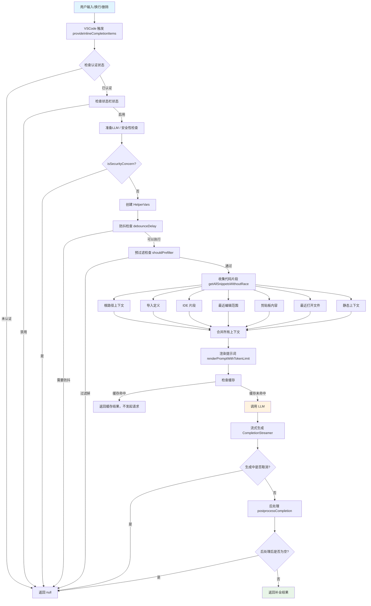
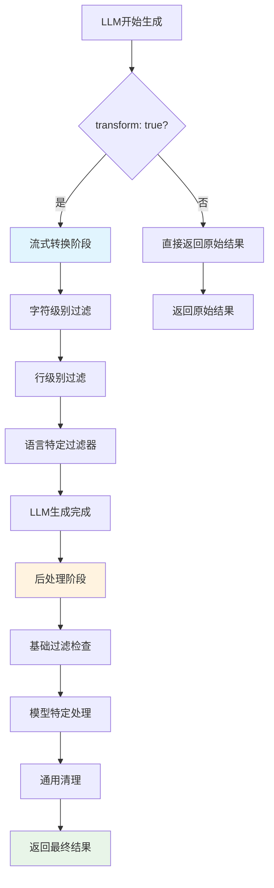

# Continue 自动补全完整技术文档：架构、流程与实现详解

DEFAULT_AUTOCOMPLETE_OPTS

## 1. 整体架构图



## 2. 关键分支与时序说明

### 2.1 前置且不发起请求的检查

#### A. 安全性检查 `isSecurityConcern`

- **检查时机**：在准备 LLM 之后，创建 HelperVars 之前
- **检查内容**：文件路径是否匹配安全敏感文件模式
- **匹配规则**：
  - 环境文件：`*.env`, `.env*`, `config.json`, `settings.json` 等
  - 证书密钥：`*.key`, `*.pem`, `*.p12`, `*.crt` 等
  - 敏感目录：`.ssh/`, `.secrets/`, `.aws/`, `.gcp/` 等
- **命中结果**：直接 `return undefined`，不发起 LLM 请求

#### B. 防抖检查 `debounceDelay`

- **检查时机**：在创建 HelperVars 之后，预过滤之前
- **检查内容**：`AutocompleteDebouncer.delayAndShouldDebounce()`
- **防抖逻辑**：

  ```typescript
  async delayAndShouldDebounce(debounceDelay: number): Promise<boolean> {
    const requestId = uuidv4();
    this.currentRequestId = requestId;

    return new Promise<boolean>((resolve) => {
      this.debounceTimeout = setTimeout(() => {
        const shouldDebounce = this.currentRequestId !== requestId;
        resolve(shouldDebounce);
      }, debounceDelay);
    });
  }
  ```

- **默认延迟**：350ms（可配置）
- **命中结果**：直接 `return undefined`，不发起 LLM 请求

#### C. 预过滤检查 `shouldPrefilter`

- **检查时机**：在防抖检查之后，上下文收集之前
- **检查内容**：`shouldPrefilter(helper, ide)`
- **过滤条件**：
  - `helper.options.disable` 为 true
  - 当前文件是 Continue 配置文件
  - 文件匹配 `disableInFiles` 模式
  - 空白 Untitled 文件（无内容）
- **命中结果**：直接 `return undefined`，不发起 LLM 请求

#### D. 缓存命中 `cacheHit`

- **检查时机**：在上下文收集和提示词渲染之后，LLM 请求之前
- **检查内容**：`AutocompleteLruCache.get(helper.prunedPrefix)`
- **缓存逻辑**：
  - 键：代码前缀
  - 值：补全结果
  - 容量：1000 个条目
  - 匹配：支持部分匹配
- **命中结果**：直接返回缓存结果，不发起 LLM 请求

### 2.2 已发起请求后的取消/失败/空结果

#### A. 生成中取消 `aborted_during_generation`

- **触发时机**：在 LLM 流式生成过程中
- **触发条件**：`token.aborted` 为 true
- **常见场景**：
  - 用户快速输入，新请求取消旧请求
  - 用户移动光标，取消当前生成
  - 用户按 Esc 键取消
- **Telemetry**：`autocomplete_cancelled`，`reason: "aborted_during_generation"`

#### B. 生成/后处理出错 `error_during_processing`

- **触发时机**：LLM 请求失败或后处理异常
- **错误类型**：
  - 网络错误：连接超时、API 限流等
  - 模型错误：token 超限、模型不可用等
  - 解析错误：响应格式异常等
- **Telemetry**：
  - `autocomplete_llm_request_failed`：记录错误详情
  - `autocomplete_cancelled`，`reason: "error_during_processing"`

#### C. 后处理后为空 `empty_completion`

- **触发时机**：LLM 生成完成，后处理结果为空
- **可能原因**：
  - 模型未生成任何内容
  - 后处理过滤掉了所有内容
  - Transform 模式下的清理过于严格
- **Telemetry**：
  - `autocomplete_llm_request_success`：记录生成成功
  - `autocomplete_cancelled`，`reason: "empty_completion"`

## 3. Telemetry 对应节点（与流程图一一对应）

将流程节点与事件埋点对上号，便于漏斗与归因。

- 触发（B 节点）→ `autocomplete_triggered`
- 开始 LLM 请求（U 节点）→ `autocomplete_llm_request_start`
- 生成成功（V 结束后）→ `autocomplete_llm_request_success`
- 生成失败（异常）→ `autocomplete_llm_request_failed`
- 取消类（D 返回的多种情况）→ `autocomplete_cancelled`，`reason` 如：
  - 生成中：`aborted_during_generation`
  - 生成/后处理错误：`error_during_processing`
  - 后处理为空：`empty_completion`

### 触发后拦截检查的时序说明

**重要**：`autocomplete_triggered` 事件在函数入口立即上报，**早于所有拦截检查**。

```typescript
// 在 CompletionProvider.provideInlineCompletionItems 中
// 1. 立即上报触发事件
void Telemetry.capture("autocomplete_triggered", triggeredEvent);

// 2. 然后才进行各种拦截检查（这些检查不会上报取消事件）
const llm = await this._prepareLlm();
if (!llm) return undefined;  // 无 telemetry 事件

if (isSecurityConcern(input.filepath)) return undefined;  // 无 telemetry 事件

if (await this.debouncer.delayAndShouldDebounce(...)) return undefined;  // 无 telemetry 事件

if (await shouldPrefilter(helper, this.ide)) return undefined;  // 无 telemetry 事件
```

**注意**：前置检查（防抖、预过滤、安全检查、无LLM等）被拦截时，**不会上报任何 `autocomplete_cancelled` 事件**，只是简单返回 `undefined`。只有已发起LLM请求后的取消才会触发 `autocomplete_cancelled` 事件。

## 4. 触发时机与前置条件

### 4.1 触发时机

**核心实现**：`core/autocomplete/CompletionProvider.ts`

#### A. 自动触发（InlineCompletionTriggerKind.Automatic）

- **VS Code 自动触发**：由 VS Code 编辑器根据用户行为自动调用补全提供程序
- **触发时机**：包括用户停止输入、新行、删除操作等（具体由 VS Code 内部逻辑控制）
- **Continue 处理**：当 `context.triggerKind === vscode.InlineCompletionTriggerKind.Automatic` 时，Continue 会响应自动触发请求

#### B. 手动触发（InlineCompletionTriggerKind.Invoke）

- **快捷键触发**：`Ctrl+Alt+Space` (Windows/Linux) 或 `Cmd+Alt+Space` (Mac)
- **命令触发**：通过命令面板调用 `continue.forceAutocomplete` 命令
- **API 触发**：通过 `editor.action.inlineSuggest.trigger` 命令触发

### 4.2 触发限制总结

#### ✅ **会触发的情况**

1. **认证通过**：通过 Shihuo 认证检查
2. **状态栏启用**：`StatusBarStatus.Enabled`
3. **非取消状态**：请求未被取消
4. **非 SCM 文件**：不在 Git 源代码管理界面
5. **单光标模式**：只有一个光标
6. **有效编辑器**：有活动的文本编辑器
7. **Notebook 支持**：Jupyter Notebook 单元格
8. **未保存文件**：有内容的临时文件
9. **选中补全**：输入 ≥4 字符且文本匹配

#### ❌ **不会触发的情况**

1. **认证失败**：未通过 Shihuo 认证
2. **状态栏禁用**：`StatusBarStatus.Disabled` 或 `Paused`
3. **请求被取消**：`token.isCancellationRequested`
4. **SCM 文件**：`document.uri.scheme === "vscode-scm"`
5. **多光标编辑**：`editor.selections.length > 1`
6. **无活动编辑器**：`!vscode.window.activeTextEditor`
7. **选中补全不匹配**：输入 <4 字符或文本不匹配

## 5. 上下文收集

并行获取多源上下文（根路径/导入/IDE/最近编辑/剪贴板/静态），统一交给渲染环节裁剪。

**核心实现**：`core/autocomplete/snippets/getAllSnippets.ts`

**注意**：实际使用 `getAllSnippetsWithoutRace` 函数，该函数不使用 `racePromise` 超时机制，所有上下文收集都是完整收集，无超时保护。

```typescript
const [
  rootPathSnippets, // 根路径上下文
  importDefinitionSnippets, // 导入定义
  ideSnippets, // IDE 片段
  diffSnippets, // 差异片段
  clipboardSnippets, // 剪贴板内容
  recentlyOpenedFileSnippets, // 最近打开文件
  staticSnippet, // 静态上下文
] = await Promise.all([
  contextRetrievalService.getRootPathSnippets(helper),
  contextRetrievalService.getSnippetsFromImportDefinitions(helper),
  IDE_SNIPPETS_ENABLED
    ? getIdeSnippets(helper, ide, getDefinitionsFromLsp)
    : [],
  [], // getDiffSnippets 暂时禁用
  getClipboardSnippets(ide),
  getSnippetsFromRecentlyOpenedFiles(helper, ide),
  helper.options.experimental_enableStaticContextualization
    ? contextRetrievalService.getStaticContextSnippets(helper)
    : [],
]);
```

## 6. 提示词渲染

### 6.1 概述

提示词渲染是 Continue 自动补全的核心环节，负责将收集的上下文信息转换为 LLM 可以理解的提示词格式。主要涉及两个核心函数：

- **`renderPrompt`**：基础渲染，无 token 限制
- **`renderPromptWithTokenLimit`**：带 token 限制的智能渲染

### 6.2 renderPromptWithTokenLimit 核心实现

**文件位置**：`core/autocomplete/templating/index.ts:212-315`

#### 6.2.1 基本流程

```typescript
export function renderPromptWithTokenLimit({
  snippetPayload,
  workspaceDirs,
  helper,
  llm,
}: {
  snippetPayload: SnippetPayload;
  workspaceDirs: string[];
  helper: HelperVars;
  llm: ILLM | undefined;
}): {
  prompt: string;
  prefix: string;
  suffix: string;
  completionOptions: Partial<CompletionOptions> | undefined;
} {
  // 1. 准备提示词上下文
  const {
    prefix: initialPrefix,
    suffix: initialSuffix,
    reponame,
    template,
    compilePrefixSuffix,
    completionOptions,
    snippets,
  } = preparePromptContext({ snippetPayload, workspaceDirs, helper });

  // 2. 构建初始提示词
  let {
    prompt,
    prefix: compiledPrefix,
    suffix: compiledSuffix,
  } = buildPrompt(
    template,
    compilePrefixSuffix,
    prefix,
    suffix,
    helper,
    snippets,
    workspaceDirs,
    reponame,
  );

  // 3. Token 限制处理
  if (llm) {
    const prune = pruneLength(llm, prompt);
    if (prune > 0) {
      // 智能裁剪 prefix 和 suffix
      // ... 裁剪逻辑
    }
  }

  // 4. 返回最终结果
  return {
    prompt,
    prefix: compiledPrefix,
    suffix: compiledSuffix,
    completionOptions: { ...completionOptions, stop: stopTokens },
  };
}
```

#### 6.2.2 上下文准备 (preparePromptContext)

```typescript
function preparePromptContext({ snippetPayload, workspaceDirs, helper }): {
  prefix: string;
  suffix: string;
  reponame: string;
  template: AutocompleteTemplate["template"];
  compilePrefixSuffix: AutocompleteTemplate["compilePrefixSuffix"] | undefined;
  completionOptions: Partial<CompletionOptions> | undefined;
  snippets: AutocompleteSnippet[];
} {
  // 确定基础 prefix/suffix
  let prefix = helper.input.manuallyPassPrefix || helper.prunedPrefix;
  let suffix = helper.input.manuallyPassPrefix ? "" : helper.prunedSuffix;
  if (suffix === "") {
    suffix = "\n";
  }

  const reponame = getUriPathBasename(workspaceDirs[0] ?? "myproject");
  const { template, compilePrefixSuffix, completionOptions } =
    getTemplate(helper);
  const snippets = getSnippets(helper, snippetPayload);

  return {
    prefix,
    suffix,
    reponame,
    template,
    compilePrefixSuffix,
    completionOptions,
    snippets,
  };
}
```

#### 6.2.3 提示词构建 (buildPrompt)

```typescript
function buildPrompt(
  template: AutocompleteTemplate["template"],
  compilePrefixSuffix: AutocompleteTemplate["compilePrefixSuffix"] | undefined,
  prefix: string,
  suffix: string,
  helper: HelperVars,
  snippets: AutocompleteSnippet[],
  workspaceDirs: string[],
  reponame: string,
): { prompt: string; prefix: string; suffix: string } {
  if (compilePrefixSuffix) {
    // 使用自定义编译函数（如 Mercury、Codestral 等多文件模板）
    [prefix, suffix] = compilePrefixSuffix(
      prefix,
      suffix,
      helper.filepath,
      reponame,
      snippets,
      helper.workspaceUris,
    );
  } else {
    // 使用默认格式化（如 StableCode、Qwen 等单文件模板）
    const formatted = formatSnippets(helper, snippets, workspaceDirs);
    prefix = [formatted, prefix].join("\n");
  }

  // 渲染模板
  const prompt =
    typeof template === "string"
      ? renderStringTemplate(
          template,
          prefix,
          suffix,
          helper.lang,
          helper.filepath,
          reponame,
        )
      : template(
          prefix,
          suffix,
          helper.filepath,
          reponame,
          helper.lang.name,
          snippets,
          helper.workspaceUris,
        );

  return { prompt, prefix, suffix };
}
```

### 6.3 模板系统

#### 6.3.1 模板类型

Continue 支持两种模板类型：

1. **字符串模板**：使用 Handlebars 语法
2. **函数模板**：自定义渲染逻辑

#### 6.3.2 模型特定模板

core/autocomplete/templating/AutocompleteTemplate.ts

```typescript
// 根据模型选择模板
export function getTemplateForModel(model: string): AutocompleteTemplate {
  const lowerCaseModel = model.toLowerCase();

  if (lowerCaseModel.includes("mercury")) {
    return mercuryMultifileFimTemplate;
  }
  if (lowerCaseModel.includes("qwen") && lowerCaseModel.includes("coder")) {
    return qwenCoderFimTemplate;
  }
  if (lowerCaseModel.includes("seed") && lowerCaseModel.includes("coder")) {
    return seedCoderFimTemplate;
  }
  if (lowerCaseModel.includes("codestral")) {
    return codestralMultifileFimTemplate;
  }
  if (lowerCaseModel.includes("codegemma")) {
    return codegemmaFimTemplate;
  }
  if (lowerCaseModel.includes("codellama")) {
    return codeLlamaFimTemplate;
  }
  if (lowerCaseModel.includes("deepseek")) {
    return deepseekFimTemplate;
  }
  if (lowerCaseModel.includes("codegeex")) {
    return codegeexFimTemplate;
  }
  if (
    lowerCaseModel.includes("starcoder") ||
    lowerCaseModel.includes("star-coder") ||
    lowerCaseModel.includes("starchat") ||
    lowerCaseModel.includes("octocoder") ||
    lowerCaseModel.includes("stable") ||
    lowerCaseModel.includes("codeqwen") ||
    lowerCaseModel.includes("qwen")
  ) {
    return stableCodeFimTemplate;
  }
  if (
    lowerCaseModel.includes("gpt") ||
    lowerCaseModel.includes("davinci-002") ||
    lowerCaseModel.includes("claude") ||
    lowerCaseModel.includes("granite3") ||
    lowerCaseModel.includes("granite-3")
  ) {
    return holeFillerTemplate;
  }

  return stableCodeFimTemplate; // 默认模板
}
```

#### 6.3.3 主要模板示例

**1. StableCode FIM 模板**

```typescript
const stableCodeFimTemplate: AutocompleteTemplate = {
  template: "<fim_prefix>{{{prefix}}}<fim_suffix>{{{suffix}}}<fim_middle>",
  completionOptions: {
    stop: [
      "<fim_prefix>",
      "<fim_suffix>",
      "<fim_middle>",
      "<file_sep>",
      "<|endoftext|>",
      "</fim_middle>",
      "</code>",
    ],
  },
};
```

**2. Qwen Coder FIM 模板**

```typescript
const qwenCoderFimTemplate: AutocompleteTemplate = {
  template:
    "<|fim_prefix|>{{{prefix}}}<|fim_suffix|>{{{suffix}}}<|fim_middle|>",
  completionOptions: {
    stop: [
      "<|endoftext|>",
      "<|fim_prefix|>",
      "<|fim_middle|>",
      "<|fim_suffix|>",
      "<|fim_pad|>",
      "<|repo_name|>",
      "<|file_sep|>",
      "<|im_start|>",
      "<|im_end|>",
    ],
  },
};
```

**3. Hole Filler 模板（GPT/Claude）**

```typescript
const holeFillerTemplate: AutocompleteTemplate = {
  template: (prefix: string, suffix: string) => {
    const SYSTEM_MSG = `You are a HOLE FILLER. You are provided with a file containing holes, formatted as '{{HOLE_NAME}}'. Your TASK is to complete with a string to replace this hole with, inside a <COMPLETION/> XML tag, including context-aware indentation, if needed. All completions MUST be truthful, accurate, well-written and correct.`;
    return (
      SYSTEM_MSG +
      `\n\n<QUERY>\n${prefix}{{FILL_HERE}}${suffix}\n</QUERY>\nTASK: Fill the {{FILL_HERE}} hole. Answer only with the CORRECT completion, and NOTHING ELSE. Do it now.\n<COMPLETION>`
    );
  },
  completionOptions: { stop: ["</COMPLETION>"] },
};
```

### 6.4 代码片段格式化

#### 6.4.1 formatSnippets 实现

```typescript
export const formatSnippets = (
  helper: HelperVars,
  snippets: AutocompleteSnippet[],
  workspaceDirs: string[],
): string => {
  const currentFilepathComment = addCommentMarks(
    getLastNUriRelativePathParts(workspaceDirs, helper.filepath, 2),
    helper,
  );

  return (
    snippets
      .map((snippet) => {
        switch (snippet.type) {
          case AutocompleteSnippetType.Code:
            return formatCodeSnippet(snippet, workspaceDirs);
          case AutocompleteSnippetType.Diff:
            return formatDiffSnippet(snippet);
          case AutocompleteSnippetType.Clipboard:
            return formatClipboardSnippet(snippet, workspaceDirs);
          case AutocompleteSnippetType.Static:
            return formatStaticSnippet(snippet);
        }
      })
      .map((item) => {
        return commentifySnippet(helper, item).content;
      })
      .join("\n") + `\n${currentFilepathComment}`
  );
};
```

#### 6.4.2 代码片段过滤 (getSnippets)

```typescript
export const getSnippets = (
  helper: HelperVars,
  payload: SnippetPayload,
): AutocompleteSnippet[] => {
  const snippets = {
    clipboard: payload.clipboardSnippets,
    recentlyVisitedRanges: payload.recentlyVisitedRangesSnippets,
    recentlyEditedRanges: payload.recentlyEditedRangeSnippets,
    diff: payload.diffSnippets,
    recentlyOpenedFiles: payload.recentlyOpenedFileSnippets,
    base: shuffleArray(
      filterSnippetsAlreadyInCaretWindow(
        [
          ...payload.rootPathSnippets,
          ...payload.importDefinitionSnippets,
          ...payload.staticSnippet,
        ],
        helper.prunedCaretWindow,
      ),
    ),
  };

  // 按优先级处理片段
  const snippetConfigs = [
    {
      key: "clipboard",
      enabledOrPriority: helper.options.experimental_includeClipboard,
      defaultPriority: 1,
    },
    {
      key: "recentlyOpenedFiles",
      enabledOrPriority: helper.options.useRecentlyOpened,
      defaultPriority: 2,
    },
    {
      key: "recentlyVisitedRanges",
      enabledOrPriority:
        helper.options.experimental_includeRecentlyVisitedRanges,
      defaultPriority: 3,
    },
    {
      key: "recentlyEditedRanges",
      enabledOrPriority:
        helper.options.experimental_includeRecentlyEditedRanges,
      defaultPriority: 4,
    },
    {
      key: "diff",
      enabledOrPriority: helper.options.experimental_includeDiff,
      defaultPriority: 5,
    },
    { key: "base", enabledOrPriority: true, defaultPriority: 6 },
  ];

  // 智能过滤和排序
  // ... 处理逻辑

  return finalSnippets;
};
```

### 6.5 Token 限制与智能裁剪

#### 6.5.1 Token 计算

```typescript
function pruneLength(llm: ILLM, prompt: string): number {
  const contextLength = llm.contextLength;
  const reservedTokens = llm.completionOptions.maxTokens ?? DEFAULT_MAX_TOKENS;
  const safetyBuffer = getTokenCountingBufferSafety(contextLength);
  const maxAllowedPromptTokens = contextLength - reservedTokens - safetyBuffer;
  const promptTokenCount = countTokens(prompt, llm.model);
  return promptTokenCount - maxAllowedPromptTokens;
}
```

#### 6.5.2 智能裁剪策略

```typescript
if (llm) {
  const prune = pruneLength(llm, prompt);
  if (prune > 0) {
    const tokensToDrop = prune;
    const prefixTokenCount = countTokens(prefix, helper.modelName);
    const suffixTokenCount = countTokens(suffix, helper.modelName);
    const totalContextTokens = prefixTokenCount + suffixTokenCount;

    if (totalContextTokens > 0) {
      // 按比例分配裁剪
      const dropPrefix = Math.ceil(
        tokensToDrop * (prefixTokenCount / totalContextTokens),
      );
      const dropSuffix = Math.ceil(tokensToDrop - dropPrefix);
      const allowedPrefixTokens = Math.max(0, prefixTokenCount - dropPrefix);
      const allowedSuffixTokens = Math.max(0, suffixTokenCount - dropSuffix);

      // 从顶部裁剪 prefix，从底部裁剪 suffix
      prefix = pruneLinesFromTop(prefix, allowedPrefixTokens, helper.modelName);
      suffix = pruneLinesFromBottom(
        suffix,
        allowedSuffixTokens,
        helper.modelName,
      );
    }
  }
}
```

### 6.6 停止标记处理

```typescript
const stopTokens = getStopTokens(
  completionOptions,
  helper.lang,
  helper.modelName,
);

return {
  prompt,
  prefix: compiledPrefix,
  suffix: compiledSuffix,
  completionOptions: {
    ...completionOptions,
    stop: stopTokens,
  },
};
```

### 6.7 渲染流程总结

1. **上下文准备**：收集所有必要的上下文信息
2. **模板选择**：根据模型选择适当的模板
3. **片段格式化**：将代码片段格式化为可读格式
4. **提示词构建**：使用模板渲染最终提示词
5. **Token 限制**：智能裁剪超出限制的内容
6. **停止标记**：设置适当的停止标记
7. **返回结果**：返回完整的渲染结果

这个渲染系统确保了 Continue 能够为不同的 LLM 模型提供最优的提示词格式，同时智能地管理 token 使用，提供高质量的代码补全体验。

合并裁剪上下文，输出前缀/后缀与提示词，受 token 预算限制。

- 合并所有收集的代码片段
- 根据模型的 token 限制裁剪内容
- 生成最终的提示词
- 返回前缀、后缀和补全选项

## 7. 缓存机制

**核心实现**：`core/autocomplete/util/AutocompleteLruCache.ts`

前缀为键的 LRU 缓存，命中直接返回结果，不发起 LLM 请求。

- **容量**：1000 个条目
- **存储**：SQLite 数据库
- **键**：代码前缀
- **值**：补全结果
- **匹配**：支持部分匹配（如 "co" 可以匹配 "c" -> "ontinue"）
- **重要时序**：命中缓存（流程图 S→T）时，不会发起 LLM 请求

## 8. Result 字段判断逻辑

### 8.1 Result 字段的三种状态

`result` 字段基于 `interaction.end.kind` 的值进行判断，用于标识自动补全请求的最终结果状态：

#### A. Success（成功）

- **判断条件**：`interaction.end.kind === "success"`
- **触发时机**：LLM 请求成功完成，生成了有效的补全内容
- **代码实现**：
  ```typescript
  // 在 core/llm/index.ts 的 _logEnd 方法中
  if (typeof error === "undefined") {
    interaction?.logItem({
      kind: "success",
      promptTokens,
      generatedTokens,
      thinkingTokens,
      usage,
    });
    return "success";
  }
  ```

#### B. Error（错误）

- **判断条件**：`interaction.end.kind === "error"`
- **触发时机**：LLM 请求过程中发生错误
- **错误类型**：
  - 网络错误：连接超时、API 限流等
  - 模型错误：token 超限、模型不可用等
  - 解析错误：响应格式异常等
- **代码实现**：
  ```typescript
  // 在 core/llm/index.ts 的 _logEnd 方法中
  else {
   interaction?.logItem({
     kind: "error",
     name: error.name,
     message: error.message,
     promptTokens,
     generatedTokens,
     thinkingTokens,
     usage,
   });
   return "error";
  }
  ```

#### C. Cancelled（取消）

- **判断条件**：`interaction.end.kind === "cancel"`
- **触发时机**：LLM 请求被用户或系统取消
- **取消场景**：
  - 用户快速输入，新请求取消旧请求
  - 用户移动光标，取消当前生成
  - 用户按 Esc 键取消
  - 超时自动取消
- **代码实现**：
  ```typescript
  // 在 core/llm/index.ts 的 _logEnd 方法中
  if (error === "cancel" || error?.name?.includes("AbortError")) {
    interaction?.logItem({
      kind: "cancel",
      promptTokens,
      generatedTokens,
      thinkingTokens,
      usage,
    });
    return "cancelled";
  }
  ```

## 9. Transform 选项

### 9.1 Transform 模式的具体处理

当 `transform: true` 时，系统会执行**两个阶段**的处理：

#### 阶段 1：流式转换（StreamTransformPipeline）

- LLM 生成内容
- 实时流式转换处理（`StreamTransformPipeline`）
- 超时时间：`modelTimeout × 2.5`（Transform: true）或 `modelTimeout`（Transform: false）

```typescript
// StreamTransformPipeline.transform() 执行顺序
charGenerator = stopAtStopTokens(generator, [...stopTokens, ...STOP_AT_PATTERNS]);
charGenerator = stopAtStartOf(charGenerator, suffix);
// 语言特定字符过滤器
for (const charFilter of helper.lang.charFilters ?? []) {
  charGenerator = charFilter({...});
}

lineGenerator = streamLines(charGenerator);
lineGenerator = stopAtLines(lineGenerator, fullStop);
lineGenerator = stopAtLinesExact(lineGenerator, fullStop, [lineBelowCursor]);
lineGenerator = stopAtRepeatingLines(lineGenerator, fullStop);
lineGenerator = avoidEmptyComments(lineGenerator, helper.lang.singleLineComment);
lineGenerator = avoidPathLine(lineGenerator, helper.lang.singleLineComment);
lineGenerator = skipPrefixes(lineGenerator);
lineGenerator = noDoubleNewLine(lineGenerator);
// 语言特定行过滤器
for (const lineFilter of helper.lang.lineFilters ?? []) {
  lineFilter({...});
}
lineGenerator = stopAtSimilarLine(lineGenerator, lineBelowCursor, fullStop);
lineGenerator = showWhateverWeHaveAtXMs(lineGenerator, timeoutValue);
```

#### 阶段 2：后处理（postprocessCompletion）

- 基础过滤检查
- 模型特定处理
- 通用清理
- 无额外超时限制，处理时间通常很短

```typescript
// 1. 基础过滤
if (isBlank(completion)) return undefined; // 过滤空白补全
if (isOnlyWhitespace(completion)) return undefined; // 过滤纯空格补全
if (rewritesLineAbove(completion, prefix)) return undefined; // 过滤重复行
if (isExtremeRepetition(completion)) return undefined; // 过滤极端重复

// 2. 模型特定的处理
if (llm.model.includes("codestral")) {
  // Codestral 模型：移除多余空格，处理换行问题
  if (completion[0] === " " && completion[1] !== " ") {
    if (prefix.endsWith(" ") && suffix.startsWith("\n")) {
      completion = completion.slice(1);
    }
  }
  // 避免双重换行
  if (
    suffix.length === 0 &&
    prefix.endsWith("\n\n") &&
    completion.startsWith("\n")
  ) {
    completion = completion.slice(1);
  }
}

if (llm.model.includes("qwen3")) {
  // Qwen3 模型：移除思考标记和多余换行
  completion = completion.replace(/<think>.*?<\/think>/s, "");
  completion = completion.replace(/<\/think>/, "");
  completion = completion.replace(/^\n+|\n+$/g, "");
}

if (llm.model.includes("granite")) {
  // Granite 模型：处理重复前缀问题
  let prefixEnd = prefix.split("\n").pop();
  if (prefixEnd) {
    if (completion.startsWith(prefixEnd)) {
      completion = completion.slice(prefixEnd.length);
    } else {
      const trimmedPrefix = prefixEnd.trim();
      const lastWord = trimmedPrefix.split(/\s+/).pop();
      if (lastWord && completion.startsWith(lastWord)) {
        completion = completion.slice(lastWord.length);
      } else if (completion.startsWith(trimmedPrefix)) {
        completion = completion.slice(trimmedPrefix.length);
      }
    }
  }
}

if (llm.model.includes("mercury")) {
  // Mercury 模型：处理缩进问题
  if (
    (completion.startsWith("  ") || completion.startsWith("\t")) &&
    !prefix.endsWith("\n") &&
    (suffix.startsWith("\n") || suffix.trim().length === 0)
  ) {
    completion = "\n" + completion;
  }
}

if (llm.model.includes("gemini") || llm.model.includes("gemma")) {
  // Gemini/Gemma 模型：移除文件分隔符
  if (completion.endsWith("<|file_separator|>")) {
    completion = completion.slice(0, -18);
  }
}

// 3. 通用清理
if (prefix.endsWith(" ") && completion.startsWith(" ")) {
  completion = completion.slice(1); // 处理空格重复问题
}
completion = removeBackticks(completion); // 移除 Markdown 代码块标记
```

#### 完整的执行流程

```typescript
// 阶段 1：流式生成 + 流式转换（有超时限制）
// 在 CompletionStreamer.ts 中的实际实现：

// 1. 创建基础生成器（带超时控制）
const generator = this.generatorReuseManager.getGenerator(
  prefix,
  (abortSignal: AbortSignal) => {
    const generator = llm.supportsFim()
      ? llm.streamFim(prefix, suffix, abortSignal, completionOptions)
      : llm.streamComplete(prompt, abortSignal, {
          ...completionOptions,
          raw: true,
        });

    // 应用 2.5 倍超时（仅当 transform: true 时）
    return helper.options.transform
      ? stopAfterMaxProcessingTime(
          generator,
          helper.options.modelTimeout * 2.5, // ← 2.5 倍超时
          fullStop,
        )
      : generator;
  },
  multiline,
);

// 2. 应用流式转换管道（仅当 transform: true 时）
const transformedGenerator = helper.options.transform
  ? this.streamTransformPipeline.transform(
      initialGenerator,
      prefix,
      suffix,
      multiline,
      completionOptions?.stop || [],
      fullStop,
      helper,
    )
  : initialGenerator;

// 阶段 2：后处理（在 CompletionProvider.ts 中）
// 在流式生成完成后进行后处理
const processedCompletion = helper.options.transform
  ? postprocessCompletion({
      completion,
      prefix: helper.prunedPrefix,
      suffix: helper.prunedSuffix,
      llm,
    })
  : completion;
```

### Transform处理流程总结



## 10. 超时机制与Generator详解

### 10.1 Generator概念

Generator就像一个**数据流管道**，数据从一端进入，经过各种处理，从另一端流出：

```typescript
// 原始数据流
LLM输出 → Generator → 过滤处理 → 最终输出给用户

// 具体例子
"function hello() {\n  return 42;\n}"
→ [各种过滤器]
→ "function hello() {\n  return 42;\n}"
```

### 10.2 多层超时机制

#### 关键理解：**同时计时**

两个超时机制是**同时启动**的，每个LLM返回的token都会经过**完整的检查链**：

```typescript
// 伪代码：每个token的处理流程
for await (const token of llmGenerator) {
  // 1. 第一层检查：stopAfterMaxProcessingTime
  if (Date.now() - startTime > modelTimeout * 2.5) {
    fullStop(); // 停止LLM
    break;
  }

  // 2. 第二层检查：showWhateverWeHaveAtXMs
  if (Date.now() - startTime > modelTimeout && hasNonWhitespaceContent) {
    yield currentContent; // 输出已有内容
    break;
  }

  // 3. 正常处理token
  yield token;
}
```

#### 第一层：`stopAfterMaxProcessingTime`

**位置**：`CompletionStreamer.ts`

```typescript
return helper.options.transform
  ? stopAfterMaxProcessingTime(
      generator,
      helper.options.modelTimeout * 2.5, // 2.5倍超时
      fullStop,
    )
  : generator;
```

**作用**：防止LLM生成时间过长

- **超时时间**：`modelTimeout * 2.5`
- **触发条件**：LLM生成超过这个时间
- **处理方式**：直接停止LLM请求

#### 第二层：`showWhateverWeHaveAtXMs`

**位置**：`StreamTransformPipeline.ts`

```typescript
const timeoutValue = helper.options.modelTimeout;
lineGenerator = showWhateverWeHaveAtXMs(lineGenerator, timeoutValue!);
```

**作用**：防止用户等待过久

- **超时时间**：`modelTimeout`（原始值）
- **触发条件**：用户等待超过这个时间
- **处理方式**：输出已有内容，停止等待

### 10.3 完整数据流示例

#### 假设配置

```typescript
modelTimeout = 1000ms  // 1秒
```

#### 数据流示例

```typescript
// 1. LLM开始生成
LLM: "function hello() {\n  return 42;\n}";

// 2. 第一层超时检查 (stopAfterMaxProcessingTime)
// 超时时间: 1000ms * 2.5 = 2500ms
// 如果LLM生成超过2.5秒 → 直接停止LLM

// 3. 第二层超时检查 (showWhateverWeHaveAtXMs)
// 超时时间: 1000ms
// 如果用户等待超过1秒 → 输出已有内容

// 4. 最终输出给用户
用户看到: "function hello() {\n  return 42;\n}";
```

#### 时间线示例

```
时间轴：0ms ────────────────────────────────── 2500ms
       │                                    │
       │  LLM开始生成                        │
       │  ↓                                │
       │  第一层计时器启动 (2.5倍超时)        │
       │  ↓                                │
       │  第二层计时器启动 (1倍超时)          │
       │  ↓                                │
       │  Token流开始处理                   │
       │  ↓                                │
       │  1000ms: 第二层触发               │
       │  ↓                                │
       │  2500ms: 第一层触发                │
```

#### 详细Token处理流程

```
时间轴：
0ms    ┌─ LLM开始生成
       ├─ 两个计时器同时启动
200ms  ├─ Token 1: "function" → 通过两层检查 → 输出
400ms  ├─ Token 2: " hello()" → 通过两层检查 → 输出
600ms  ├─ Token 3: " {\n" → 通过两层检查 → 输出
800ms  ├─ Token 4: "  return" → 通过两层检查 → 输出
1000ms ├─ 第二层触发：showWhateverWeHaveAtXMs
       ├─ 输出已有内容，停止等待
       └─ 用户看到: "function hello() {\n  return"

2500ms ┌─ 第一层触发：stopAfterMaxProcessingTime
       └─ 停止LLM（如果还在生成）
```

### 10.4 为什么需要两层超时？

#### 第一层：保护系统

- **目的**：防止LLM无限生成
- **时间**：较长（2.5倍）
- **作用**：确保系统不会卡死

#### 第二层：保护用户

- **目的**：防止用户等待过久
- **时间**：较短（1倍）
- **作用**：确保用户体验

### 10.5 实际效果对比

| 情况         | 第一层超时 | 第二层超时 | 用户看到 |
| ------------ | ---------- | ---------- | -------- |
| **快速生成** | 不触发     | 不触发     | 完整内容 |
| **中等生成** | 不触发     | 触发       | 部分内容 |
| **慢速生成** | 触发       | 触发       | 部分内容 |

### 10.6 Generator的本质

```typescript
// Generator 就像一个数据管道
async function* dataPipe() {
  yield "function"; // 第一个chunk
  yield " hello()"; // 第二个chunk
  yield " {\n  return"; // 第三个chunk
  yield " 42;\n}"; // 第四个chunk
}

// 使用Generator
for await (const chunk of dataPipe()) {
  console.log(chunk); // 逐个输出chunk
}
```

**Generator 就是数据的"流水线"**，数据从一端流到另一端，中间可以添加各种过滤器！

### 10.7 showWhateverWeHaveAtXMs 触发逻辑

#### 触发条件

1. **时间检查**：`Date.now() - startTime > ms`
2. **内容检查**：`firstNonWhitespaceLineYielded === true`

**关键点**：必须**同时满足**超时和已产出非空白内容两个条件才会中断。

#### 核心逻辑

```typescript
export async function* showWhateverWeHaveAtXMs(
  lines: LineStream,
  ms: number, // Timeout in milliseconds
): LineStream {
  const startTime = Date.now();
  let firstNonWhitespaceLineYielded = false;

  for await (const line of lines) {
    yield line; // 先输出当前行

    // 标记是否产出过有效内容
    if (!firstNonWhitespaceLineYielded && line.trim() !== "") {
      firstNonWhitespaceLineYielded = true;
    }

    const isTakingTooLong = Date.now() - startTime > ms;
    if (isTakingTooLong && firstNonWhitespaceLineYielded) {
      break; // 停止：超时且已有非空白内容
    }
  }
}
```

#### 触发情况分析表

| 情况                | 超时状态 | 是否有非空白内容 | 是否会 break   | 说明                     |
| ------------------- | -------- | ---------------- | -------------- | ------------------------ |
| ✅ 正常终止         | false    | true             | ❌ 不break     | 未超时，等待完整输出     |
| ✅ **超时且有内容** | true     | true             | ✅ **break**   | 触发提前终止             |
| ⚠️ **超时但无内容** | true     | false            | ❌ **不break** | 继续等待至少一条有效内容 |
| ⚠️ 无内容且结束     | false    | false            | ❌ 不break     | 直到流结束               |

#### 特殊行为：超时但没有非空白内容

**关键逻辑**：

```typescript
if (isTakingTooLong && firstNonWhitespaceLineYielded) {
  break; // 只有两个条件都满足才会中断
}
```

**如果一直没产出任何非空白行**：

- ✅ 即使超时了也不会中断
- ✅ 函数会继续 `for await` 直到：
  - 未来某一行出现非空白 → **立即 break**
  - 或者输入流完全结束（EOF）

**举例说明**：

| 输入流内容                  | 超时时间 | 3秒后行为                               |
| --------------------------- | -------- | --------------------------------------- |
| `""`, `""`, `""`, `"Hello"` | 3秒      | ✅ 继续等待直到看到 "Hello"，然后 break |
| `""`, `""`, `""`, EOF       | 3秒      | ✅ 不 break，直接读到 EOF 结束          |
| `"   "`（只有空格）         | 3秒      | ✅ 一直等到结束才退出                   |

#### 设计目的

> **避免用户看到全是空白内容就结束了**  
> **确保至少给出一个有价值的首响应**

这个设计确保了：

1. 用户不会看到一个全是空格的补全结果
2. 系统会耐心等待至少一条有意义的内容
3. 一旦有了内容，就可以在超时后优雅地结束

#### 如果没有超时会怎么样？

- **正常情况**：LLM生成完成，输出完整内容
- **用户看到**：完整的补全结果
- **无额外处理**：直接返回给用户

### 10.8 llm.streamComplete 返回的Generator

#### Generator类型

```typescript
async *streamComplete(
  _prompt: string,
  signal: AbortSignal,
  options: LLMFullCompletionOptions = {},
): AsyncGenerator<string>
```

#### Generator内容

- **返回类型**：`AsyncGenerator<string>`
- **每个chunk**：字符串片段
- **累积方式**：`completion += chunk`
- **日志记录**：每个chunk都会记录到interaction

#### 使用示例

```typescript
// 在CompletionStreamer中使用
for await (const update of transformedGenerator) {
  yield update; // 将chunk传递给上层
}
```

这个Generator系统确保了Continue能够高效地处理流式LLM响应，同时提供灵活的超时控制和用户体验优化。

## 11. 行过滤系统详解

### 11.1 行过滤架构概览

Continue的行过滤系统是一个多层次的管道，每个过滤器都有特定的职责，确保输出的代码补全质量。整个系统分为**字符级过滤**和**行级过滤**两个阶段。

### 11.2 过滤器类型定义

```typescript
export type LineFilter = (args: {
  lines: LineStream; // 输入行流
  fullStop: () => void; // 停止函数
}) => LineStream;

export type CharacterFilter = (args: {
  chars: AsyncGenerator<string>; // 字符流
  prefix: string;
  suffix: string;
  filepath: string;
  multiline: boolean;
}) => AsyncGenerator<string>;
```

### 11.3 核心行过滤器详解

#### A. **stopAtLines - 停止标记过滤**

```typescript
export async function* stopAtLines(
  stream: LineStream,
  fullStop: () => void,
  linesToStopAt: string[] = LINES_TO_STOP_AT,
): LineStream {
  for await (const line of stream) {
    let shouldStop = false;

    // 检查每个停止短语
    for (const stopAt of linesToStopAt) {
      if (line.includes(stopAt)) {
        const validation = validatePatternInLine(line, stopAt);

        if (!validation.isValid) {
          continue;
        }

        // 检查停止短语是否在逻辑开头
        const trimmedLine = line.trimStart();
        if (trimmedLine.startsWith(stopAt)) {
          shouldStop = true;
          break;
        } else {
          // 检查是否有适当的分隔
          const contentBeforeStopPhrase = validation.beforePattern.trimEnd();
          if (
            contentBeforeStopPhrase.length < validation.beforePattern.length
          ) {
            shouldStop = true;
            break;
          }
        }
      }
    }

    if (shouldStop) {
      fullStop();
      break;
    }
    yield line;
  }
}
```

**作用**：

- 防止生成不相关的内容
- 在遇到特定标记时停止生成
- 使用`validatePatternInLine`确保标记在有效上下文中

**停止标记**：

````typescript
export const LINES_TO_STOP_AT = [
  "# End of file.",
  "<STOP EDITING HERE",
  "<|/updated_code|>",
  "```",
];
````

#### B. **stopAtLinesExact - 精确行匹配**

```typescript
export async function* stopAtLinesExact(
  stream: LineStream,
  fullStop: () => void,
  linesToStopAt: string[],
): LineStream {
  for await (const line of stream) {
    if (linesToStopAt.some((stopAt) => line === stopAt)) {
      fullStop();
      break;
    }
    yield line;
  }
}
```

**作用**：

- 防止重复生成光标下方的行
- 精确匹配，避免误判
- 确保补全不会重复现有内容

#### C. **stopAtRepeatingLines - 重复行过滤**

```typescript
export async function* stopAtRepeatingLines(
  lines: LineStream,
  fullStop: () => void,
): LineStream {
  let previousLine: string | undefined;
  let repeatCount = 0;
  const MAX_REPEATS = 3;

  for await (const line of lines) {
    if (line === previousLine) {
      repeatCount++;
      if (repeatCount === MAX_REPEATS) {
        fullStop();
        return;
      }
    } else {
      yield line;
      repeatCount = 1;
    }
    previousLine = line;
  }
}
```

**作用**：

- 防止生成重复的行
- 最多允许3次重复
- 避免LLM陷入循环生成

#### D. **avoidEmptyComments - 空注释过滤**

```typescript
export async function* avoidEmptyComments(
  stream: LineStream,
  comment?: string,
): LineStream {
  for await (const line of stream) {
    if (!comment || line.trim() !== comment) {
      yield line;
    }
  }
}
```

**作用**：

- 过滤掉空的注释行
- 例如：过滤 `//` 或 `/* */` 这样的空注释
- 保持代码的简洁性

#### E. **avoidPathLine - 路径行过滤**

```typescript
export async function* avoidPathLine(
  stream: LineStream,
  comment?: string,
): LineStream {
  for await (const line of stream) {
    if (line.startsWith(`${comment} Path: `)) {
      continue; // 跳过路径行
    }
    yield line;
  }
}
```

**作用**：

- 过滤掉文件路径行
- 例如：过滤 `// Path: src/components/Button.tsx`
- 防止LLM复制上下文中的路径信息

#### F. **skipPrefixes - 前缀跳过**

```typescript
export async function* skipPrefixes(lines: LineStream): LineStream {
  let isFirstLine = true;
  for await (const line of lines) {
    if (isFirstLine) {
      const match = PREFIXES_TO_SKIP.find((prefix) => line.startsWith(prefix));
      if (match) {
        yield line.slice(match.length);
        continue;
      }
      isFirstLine = false;
    }
    yield line;
  }
}
```

**作用**：

- 跳过第一行的特定前缀
- 例如：跳过 `<COMPLETION>` 前缀
- 确保输出从实际代码开始

#### G. **noDoubleNewLine - 双换行过滤**

```typescript
export async function* noDoubleNewLine(lines: LineStream): LineStream {
  let isFirstLine = true;

  for await (const line of lines) {
    if (line.trim() === "" && !isFirstLine) {
      return; // 遇到空行就停止
    }

    isFirstLine = false;
    yield line;
  }
}
```

**作用**：

- 防止生成多个连续的换行符
- 保持代码的紧凑性
- 避免不必要的空白行

#### H. **stopAtSimilarLine - 相似行过滤**

```typescript
export async function* stopAtSimilarLine(
  stream: LineStream,
  line: string,
  fullStop: () => void,
): AsyncGenerator<string> {
  const trimmedLine = line.trim();
  const lineIsBracketEnding = isBracketEnding(trimmedLine);

  for await (const nextLine of stream) {
    if (trimmedLine === "") {
      yield nextLine;
      continue;
    }

    if (lineIsBracketEnding && trimmedLine.trim() === nextLine.trim()) {
      yield nextLine;
      continue;
    }

    if (nextLine === line) {
      fullStop();
      break;
    }

    if (lineIsRepeated(nextLine, trimmedLine)) {
      fullStop();
      break;
    }

    yield nextLine;
  }
}
```

**作用**：

- 防止生成与光标下方行相似的内容
- 使用编辑距离算法判断相似性
- 确保补全的准确性

### 11.4 相似性判断算法

#### **lineIsRepeated - 重复行判断**

```typescript
export function lineIsRepeated(a: string, b: string): boolean {
  if (a.length <= 4 || b.length <= 4) {
    return false;
  }

  const aTrim = a.trim();
  const bTrim = b.trim();
  return distance(aTrim, bTrim) / bTrim.length < 0.1;
}
```

**算法特点**：

- 使用Levenshtein距离算法判断行相似性
- 相似度阈值：10%
- 短行（≤4字符）不参与比较
- 基于`fastest-levenshtein`库实现

### 11.5 高级过滤器

#### A. **filterEnglishLinesAtStart - 过滤开头的英文解释**

```typescript
export async function* filterEnglishLinesAtStart(lines: LineStream) {
  let i = 0;
  let wasEnglishFirstLine = false;
  for await (const line of lines) {
    if (i === 0 && line.trim() === "") {
      continue; // 跳过开头的空行
    }

    if (i === 0) {
      if (isEnglishFirstLine(line)) {
        wasEnglishFirstLine = true;
        i++;
        continue; // 跳过英文解释行
      }
    } else if (i === 1 && wasEnglishFirstLine && line.trim() === "") {
      i++;
      continue; // 跳过英文解释后的空行
    }
    i++;
    yield line;
  }
}
```

**英文检测规则**：

```typescript
export const ENGLISH_START_PHRASES = [
  "here is",
  "here's",
  "sure, here",
  "sure thing",
  "sure!",
  "to fill",
  "certainly",
  "of course",
  "the code should",
];
```

#### B. **filterEnglishLinesAtEnd - 过滤结尾的英文解释**

````typescript
export async function* filterEnglishLinesAtEnd(lines: LineStream) {
  let finishedCodeBlock = false;

  for await (const line of lines) {
    if (line.trim() === "```") {
      finishedCodeBlock = true;
    }
    if (finishedCodeBlock && isEnglishPostExplanation(line)) {
      break; // 遇到英文解释就停止
    }
    yield line;
  }
}
````

**英文结尾检测**：

```typescript
export const ENGLISH_POST_PHRASES = [
  "explanation:",
  "here is",
  "here's how",
  "the above",
];
```

### 11.6 工具函数

#### **validatePatternInLine - 模式验证**

```typescript
export function validatePatternInLine(
  line: string,
  pattern: string,
): {
  isValid: boolean;
  patternIndex: number;
  beforePattern: string;
} {
  const patternIndex = line.indexOf(pattern);

  if (patternIndex === -1) {
    return { isValid: false, patternIndex: -1, beforePattern: "" };
  }

  // 检查模式前是否有非空白字符
  if (patternIndex > 0) {
    const charBefore = line[patternIndex - 1];
    if (charBefore && !charBefore.match(/\s/)) {
      return { isValid: false, patternIndex, beforePattern: "" };
    }
  }

  // 检查是否在引号内
  const beforePattern = line.substring(0, patternIndex);
  const singleQuotes = (beforePattern.match(/'/g) || []).length;
  const doubleQuotes = (beforePattern.match(/"/g) || []).length;

  if (singleQuotes % 2 !== 0 || doubleQuotes % 2 !== 0) {
    return { isValid: false, patternIndex, beforePattern };
  }

  return { isValid: true, patternIndex, beforePattern };
}
```

**验证逻辑**：

1. **位置检查**：确保模式不在标识符中间
2. **引号检查**：确保模式不在字符串内
3. **上下文检查**：确保模式在有效上下文中

### 11.7 过滤器执行顺序

```typescript
// 在StreamTransformPipeline中的执行顺序
lineGenerator = stopAtLines(lineGenerator, fullStop);
lineGenerator = stopAtLinesExact(lineGenerator, fullStop, [lineBelowCursor]);
lineGenerator = stopAtRepeatingLines(lineGenerator, fullStop);
lineGenerator = avoidEmptyComments(
  lineGenerator,
  helper.lang.singleLineComment,
);
lineGenerator = avoidPathLine(lineGenerator, helper.lang.singleLineComment);
lineGenerator = skipPrefixes(lineGenerator);
lineGenerator = noDoubleNewLine(lineGenerator);

// 语言特定行过滤器
for (const lineFilter of helper.lang.lineFilters ?? []) {
  lineGenerator = lineFilter({ lines: lineGenerator, fullStop });
}

lineGenerator = stopAtSimilarLine(lineGenerator, lineBelowCursor, fullStop);
lineGenerator = showWhateverWeHaveAtXMs(lineGenerator, timeoutValue!);
```

### 11.8 语言特定过滤器

不同编程语言可以定义特定的过滤器：

```typescript
// JavaScript特定过滤器示例
const javascriptLineFilters = [
  // 过滤console.log调试语句
  (lines: LineStream) => filterConsoleLogs(lines),
  // 过滤TODO注释
  (lines: LineStream) => filterTodoComments(lines),
];

// Python特定过滤器示例
const pythonLineFilters = [
  // 过滤print调试语句
  (lines: LineStream) => filterPrintStatements(lines),
  // 处理缩进问题
  (lines: LineStream) => fixIndentation(lines),
];
```

### 11.9 设计原则

1. **渐进式过滤**：从基础到高级，逐步精细化
2. **上下文感知**：根据代码上下文应用不同规则
3. **性能优化**：流式处理，不等待完整内容
4. **用户体验**：确保输出质量，避免无用内容
5. **准确性**：防止重复和无关内容
6. **语言感知**：支持不同编程语言的特定规则

### 11.10 实际应用场景

#### **场景1：防止重复生成**

```typescript
// 用户输入
function calculateSum() {
  // 光标在这里

// LLM可能生成
function calculateSum() {
  return a + b;
}
function calculateSum() {  // ← 重复，被stopAtSimilarLine过滤
  return a + b;
}
```

#### **场景2：过滤英文解释**

```typescript
// LLM原始输出
Here is the implementation:
function calculateSum() {
  return a + b;
}

// 经过filterEnglishLinesAtStart过滤后
function calculateSum() {
  return a + b;
}
```

#### **场景3：防止无限循环**

```typescript
// LLM可能生成
console.log("test");
console.log("test");
console.log("test");
console.log("test"); // ← 超过3次重复，被stopAtRepeatingLines停止
```

这个行过滤系统确保了Continue能够提供高质量、准确的代码补全，同时保持良好的用户体验！

## 12. 防抖机制详解

### 12.1 防抖的作用

**核心目的**：防止用户快速输入时触发过多的LLM请求，提升性能并降低API调用成本。

### 12.2 防抖实现原理

#### 代码实现

```typescript
export class AutocompleteDebouncer {
  private debounceTimeout: NodeJS.Timeout | undefined = undefined;
  private currentRequestId: string | undefined = undefined;

  async delayAndShouldDebounce(debounceDelay: number): Promise<boolean> {
    // 为这次请求生成唯一ID
    const requestId = uuidv4();
    this.currentRequestId = requestId;

    // 清除之前的定时器
    if (this.debounceTimeout) {
      clearTimeout(this.debounceTimeout);
    }

    // 创建新的Promise，在防抖延迟后resolve
    return new Promise<boolean>((resolve) => {
      this.debounceTimeout = setTimeout(() => {
        // 延迟结束后，检查是否还是最新的请求
        const shouldDebounce = this.currentRequestId !== requestId;

        // 如果这是最新请求，清除标记
        if (!shouldDebounce) {
          this.currentRequestId = undefined;
        }

        resolve(shouldDebounce);
      }, debounceDelay);
    });
  }
}
```

### 12.3 防抖工作流程

#### 时间线示例

假设 `debounceDelay = 350ms`，用户输入 "helo"：

```
时间    | 输入   | 触发请求ID | currentRequestId | 是否发起请求
--------|--------|-----------|-----------------|------------
0ms     | "h"    | req-1     | req-1           | 等待350ms...
100ms   | "he"   | req-2     | req-2           | ❌ 取消req-1，等待350ms...
250ms   | "hel"  | req-3     | req-3           | ❌ 取消req-2，等待350ms...
400ms   | "helo" | req-4     | req-4           | ❌ 取消req-3，等待350ms...
750ms   | -      | -         | req-4           | ✅ req-4发起请求
```

#### 关键点

1. **延迟执行**：每次输入后等待 `debounceDelay` 毫秒
2. **取消旧请求**：新输入会取消之前的定时器
3. **只执行最新请求**：只有最后一次延迟结束后的请求才会真正执行

### 12.4 防抖判断逻辑

```typescript
if (this.currentRequestId !== requestId) {
  // 说明这不是最新的请求，已经被后续输入覆盖
  resolve(true); // 返回 true，表示应该防抖（取消此请求）
} else {
  // 这是最新请求，可以执行
  resolve(false); // 返回 false，表示不应该防抖
}
```

### 12.5 使用场景

#### 在 CompletionProvider 中的使用

```typescript
if (!force) {
  if (await this.debouncer.delayAndShouldDebounce(options.debounceDelay)) {
    return undefined; // 被防抖了，不执行自动补全
  }
}
// ✅ 防抖通过，继续执行自动补全逻辑
// 1. 创建 HelperVars
// 2. 获取上下文片段
// 3. 渲染 prompt
// 4. 调用 LLM 请求 ← 这里才真正发出请求
```

#### 请求发送时机

**关键点**：防抖只影响是否执行后续逻辑，**不影响请求本身的发送时机**

| 情况   | 防抖结果 | 是否发送请求  | 说明                                           |
| ------ | -------- | ------------- | ---------------------------------------------- |
| 旧请求 | `true`   | ❌ **不发送** | 延迟期间被新请求覆盖，直接 return undefined    |
| 新请求 | `false`  | ✅ **发送**   | 等待 350ms 后，继续执行后续逻辑并发送 LLM 请求 |

**请求实际发送的位置**：

```typescript
// 在 streamCompletionWithFilters 中
const generator = llm.supportsFim()
  ? llm.streamFim(prefix, suffix, abortSignal, completionOptions)  // ← 这里才真正发起 HTTP 请求
  : llm.streamComplete(prompt, abortSignal, {...});
```

### 12.6 防抖效果对比

#### 没有防抖的情况下

```
用户输入: h-e-l-l-o
触发请求: 5次
LLM调用: 5次
资源消耗: 高 ❌
响应时间: 快（但可能显示不完整结果） ⚠️
```

#### 有防抖的情况下

```
用户输入: h-e-l-l-o
触发请求: 5次
实际执行: 1次（最后一个）
LLM调用: 1次
资源消耗: 低 ✅
响应时间: 略慢（需要等待350ms）✅
```

### 12.7 防抖配置

#### 默认配置

```typescript
// core/util/parameters.ts
export const DEFAULT_AUTOCOMPLETE_OPTS = {
  debounceDelay: 350, // 毫秒
  // ...
};
```

#### 配置选项

- **较短延迟**（如 200ms）：响应更快，但可能触发更多LLM调用
- **较长延迟**（如 500ms）：减少LLM调用，但用户体验可能感觉较慢
- **默认值 350ms**：平衡用户体验和性能

### 12.8 特殊情况处理

#### Force 模式

```typescript
if (!force) {  // force=true 时跳过防抖
  if (await this.debouncer.delayAndShouldDebounce(...)) {
    return undefined;
  }
}
```

**使用场景**：

- 用户手动触发补全
- 确保立即执行的场景

### 12.9 防抖 vs 节流

| 特性     | **防抖（Debounce）** | **节流（Throttle）** |
| -------- | -------------------- | -------------------- |
| 实现方式 | 延迟执行             | 限流执行             |
| 执行时机 | 最后一次输入后       | 固定间隔执行         |
| 适用场景 | 搜索框、自动补全     | 滚动事件、拖拽       |
| Continue | ✅ 使用防抖          | ❌ 不使用            |

### 12.10 总结

防抖机制通过以下方式优化自动补全：

1. ✅ **减少API调用**：避免频繁的LLM请求
2. ✅ **节省资源**：减少网络流量和计算资源
3. ✅ **降低成本**：减少API调用费用
4. ✅ **提升稳定性**：避免并发请求导致的竞态条件
5. ⚠️ **略微延迟**：需要等待固定时间后才能执行

---

## 13. JetBrains 自动补全全流程

JetBrains（IntelliJ 系列）插件与 VS Code 共用核心自动补全逻辑，IDE 侧负责触发、UI 呈现和 RPC 转发。关键代码位于 `extensions/intellij/src/main/kotlin/com/github/continuedev/continueintellijextension/`。

### 13.1 入口：`ContinueInlineCompletionProvider`

- 实现 IntelliJ `InlineCompletionProvider` 接口。
- `isEnabled` 同时检查插件设置 `enableTabAutocomplete` 与触发事件类型，只允许 `DocumentChange` / `LookupChange` / 手动触发。
- `getSuggestion` 为每次请求生成 `completionId`，并区分 Next Edit（智能多步编辑）与普通灰字补全两条路径。
- `insertHandler` 在用户接受补全后调用 `CompletionService.acceptAutocomplete`，把结果回传给核心服务。

### 13.2 普通灰字补全

- 由 `CompletionService`（`ContinueCompletionService` 实现）与核心 Node 进程通信。
- 构造输入（文件 URL、光标行列、剪贴板与最近编辑占位字段）后，通过 `ContinuePluginService.coreMessenger` 发送 `autocomplete/complete`。
- 响应通过 `InlineCompletionSingleSuggestion` + `InlineCompletionGrayTextElement` 以内联灰字形式呈现。
- 用户接受后触发 `autocomplete/accept`，带上 `completionId` 供 telemetry / 缓存更新。

#### 13.2.1 不会发起 LLM 请求的典型场景

1. **入口被禁用**：`isEnabled` 要求设置启用且触发事件正确，否则 Provider 根本不会被调用。

```30:36:extensions/intellij/src/main/kotlin/com/github/continuedev/continueintellijextension/autocomplete/ContinueInlineCompletionProvider.kt
val isSettingEnabled = ContinueExtensionSettings.instance.continueState.enableTabAutocomplete
val isEventOk = event is InlineCompletionEvent.DirectCall
        || event is InlineCompletionEvent.DocumentChange
        || event is InlineCompletionEvent.LookupChange
return isSettingEnabled && isEventOk
```

2. **无 Project/编辑器异常**：`request.editor.project` 为 `null` 直接返回空补全，不会继续执行。

```38:44:extensions/.../ContinueInlineCompletionProvider.kt
val project = editor.project ?: return InlineCompletionSuggestion.Empty
```

3. **Next Edit 未产出结果**：`NextEditService.handleCaseX()` 返回 `null`（链不存在、预测失败、跳转缓存缺失），Provider 立即 `return Empty`，不会 fallback 到普通灰字请求。
4. **Next Edit 判定为非 FIM**：`NextEditUtils.checkFim` 返回 `NotFimEdit` 时改为弹窗 UI，同样 `return Empty`；此时没有新的 LLM 请求，只展示 `nextEdit/predict` 既有结果。

```92:121:extensions/.../ContinueInlineCompletionProvider.kt
is FimResult.NotFimEdit -> {
    nextEditWindowManager.showNextEditWindow(...)
    return InlineCompletionSuggestion.Empty
}
```

5. **普通灰字补全未返回内容**：`CompletionService.getAutocomplete` 返回 `null`（例如核心拒绝、缓存 miss 且后端出错）时，Provider 也直接放弃，不会额外请求其他模型。

```123:134:extensions/.../ContinueInlineCompletionProvider.kt
val variant = project.service<CompletionService>().getAutocomplete(...)
if (variant == null)
    return InlineCompletionSuggestion.Empty
```

这些前置短路保证了只有在必要情况下才会真正发起 `autocomplete/complete` 或 Next Edit 的 LLM 请求。

### 13.3 Next Edit 流程

1. **能力检测**（`NextEditStatusService`）
   - 后台校验 Continue 认证用户，要求邮箱 `@continue.dev`（当前限制）。
   - 读取 `ProfileInfoService` 模型配置，判断是否具备 `nextEdit` 能力或匹配 Mercury Coder / Instinct 等白名单模型。
2. **Case 分支**（`NextEditService`）
   - **Case 1：Typing** —— 无链路时调用 `nextEdit/startChain` 并请求 `nextEdit/predict`。
   - **Case 2：Jumping** —— 已跳转时从 `NextEditJumpManager` 缓存中拿结果（避免重复请求）。
   - **Case 3：Chain exists, no jump** —— 遍历 `nextEdit/queue/dequeueProcessed` 返回的队列，提示跳转或结束链。
3. **结果呈现**
   - 利用 `NextEditUtils.checkFim` 对比旧/新片段，判断是否为纯插入（FIM）。
   - **FIM**：以灰字 inline completion 呈现，用户可直接 Tab 接受。
   - **非 FIM**：调用 `NextEditWindowManager.showNextEditWindow` 弹出 Next Edit UI，展示 diff、跳转按钮及接受/拒绝操作。
4. **后续操作**
   - 接受/拒绝通过 `nextEdit/accept`、`nextEdit/reject` 通知核心；必要时 `nextEdit/deleteChain`。
   - `NextEditService` 维护 `displayedCompletions`，映射 `completionId` 与已展示结果，保证后续交互一致。

### 13.4 与 VS Code 共享的核心逻辑

- IntelliJ 侧不做上下文收集或 LLM 调用，这些都由核心 Node/TS 服务完成（同文档前述章节）。
- 缓存命中、Transform 流式过滤、超时与 telemetry 事件路径与 VS Code 完全一致，只是入口 API 不同。
- Next Edit RPC (`nextEdit/*`) 在两个 IDE 中共用，实现一致的链式编辑体验。

综上，JetBrains 插件通过 `ContinueInlineCompletionProvider` 把 IDE 事件桥接到核心服务，并根据是否启用 Next Edit 在“灰字补全”与“多步编辑”之间切换，实现与 VS Code 一致的自动补全体验。
